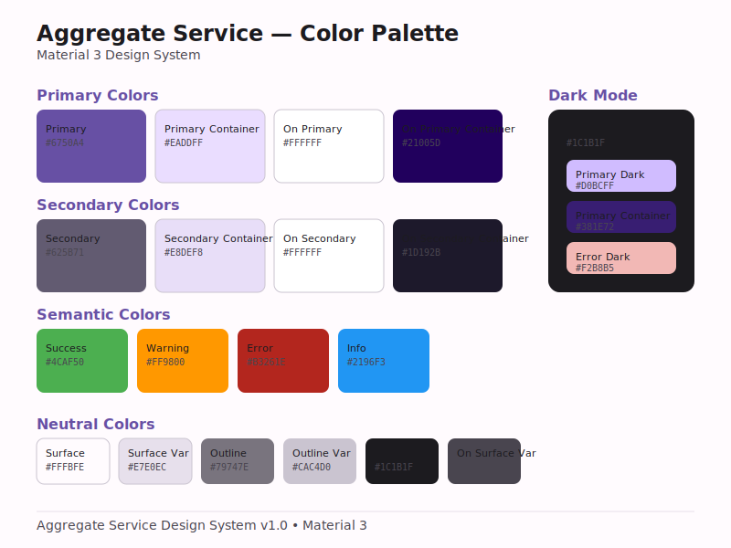
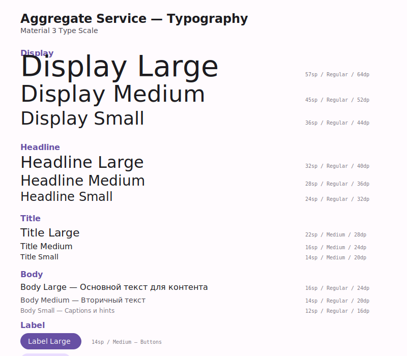
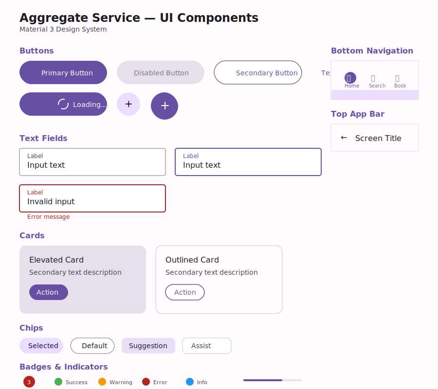
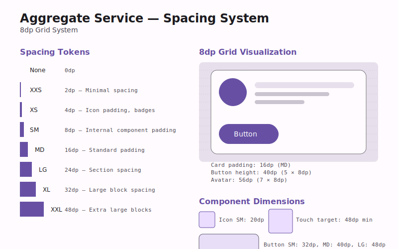
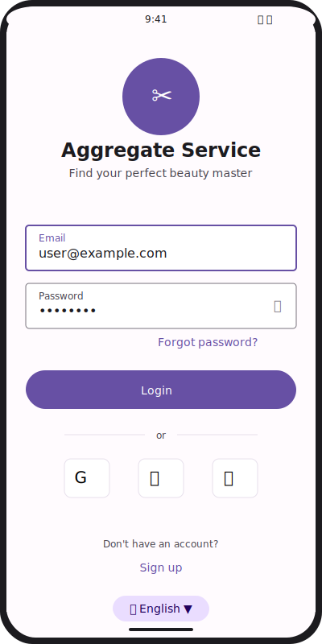
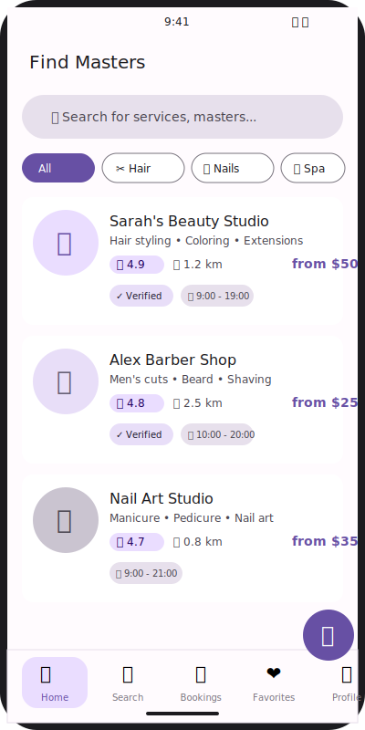

# Design System Assets

Визуальные материалы Design System Aggregate Service.

---

## Файлы

| Файл | Описание | Размер |
|------|----------|--------|
| [color-palette.svg](color-palette.svg) | Цветовая палитра Material 3 | 800×600 |
| [typography.svg](typography.svg) | Типографика Type Scale | 800×700 |
| [components.svg](components.svg) | UI компоненты | 900×800 |
| [spacing.svg](spacing.svg) | Spacing система (8dp grid) | 800×500 |
| [login-screen.svg](login-screen.svg) | Экран входа (мокап) | 400×800 |
| [catalog-screen.svg](catalog-screen.svg) | Каталог мастеров (мокап) | 400×800 |

---

## Цветовая палитра



### Primary Colors

| Цвет | Hex | Использование |
|------|-----|---------------|
| Primary | `#6750A4` | Основные кнопки, FAB |
| Primary Container | `#EADDFF` | Фон карточек, чипсов |
| On Primary | `#FFFFFF` | Текст на primary |

### Semantic Colors

| Цвет | Hex | Использование |
|------|-----|---------------|
| Success | `#4CAF50` | Успешные действия |
| Warning | `#FF9800` | Предупреждения |
| Error | `#B3261E` | Ошибки |
| Info | `#2196F3` | Информация |

---

## Типографика



### Основные стили

| Стиль | Размер | Использование |
|-------|--------|---------------|
| Display Large | 57sp | Заголовки экранов |
| Headline Large | 32sp | Заголовки секций |
| Title Large | 22sp | Заголовки списков |
| Body Large | 16sp | Основной текст |
| Label Large | 14sp | Кнопки |

---

## Компоненты



### Buttons

- **Primary Button** — заполненные кнопки для основных действий
- **Secondary Button** — outlined кнопки для вторичных действий
- **Text Button** — текстовые кнопки
- **FAB** — плавающая кнопка действия

### Text Fields

- Default, Focused, Error states
- Label, Input, Error message

### Cards

- Elevated Card — с тенью
- Outlined Card — с границей

---

## Spacing



### 8dp Grid System

| Token | Value | Использование |
|-------|-------|---------------|
| XXS | 2dp | Минимальные отступы |
| XS | 4dp | Icon padding, badges |
| SM | 8dp | Внутренние отступы |
| MD | 16dp | Стандартные отступы |
| LG | 24dp | Между секциями |
| XL | 32dp | Между экранами |
| XXL | 48dp | Большие блоки |

---

## Мокапы экранов

### Login Screen



### Catalog Screen



---

## Использование

### В Markdown

```markdown

```

### В HTML

```html

```

### В Figma

Импортируйте SVG файлы напрямую в Figma для редактирования.

---

**Назад:** [← Design System](../04_DESIGN_SYSTEM.md)
